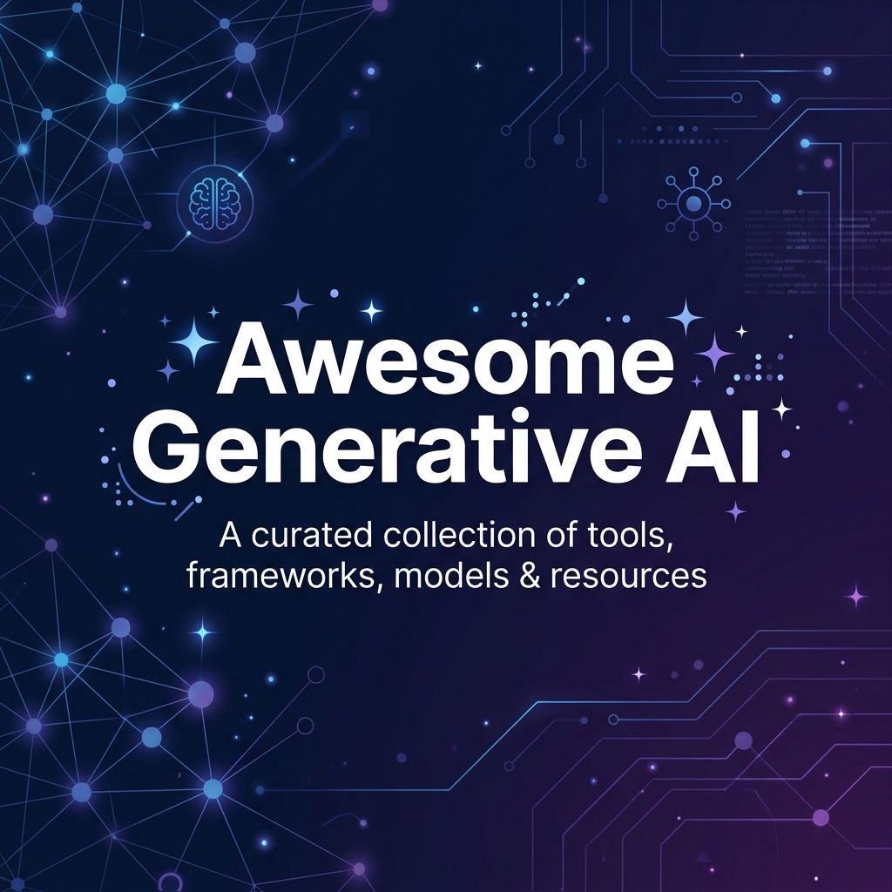

<div align="center">



<br/>
<br/>

[](https://awesome.re)
[](https://github.com/prateekpatil0805-ui/newfolder/stargazers)
[](https://github.com/prateekpatil0805-ui/newfolder/network/members)
[](https://github.com/prateekpatil0805-ui/newfolder/pulls)
[](LICENSE)
[]()

**A comprehensive, community-curated collection of Generative AI tools, frameworks, models, and learning resources.**

*Your one-stop guide to the modern GenAI ecosystem — updated weekly.*

[Explore](#contents) · [Contribute](CONTRIBUTING.md) · [Report Issue](https://github.com/prateekpatil0805-ui/newfolder/issues)

</div>

---

> **Why this list?** The GenAI landscape is evolving at breakneck speed. New models, tools, and frameworks launch every week. This curated list saves you hundreds of hours of research by organizing the best resources in one place — verified, categorized, and regularly updated by the community.

---

## Contents

- [🧠 Large Language Models](#-large-language-models)
  - [Proprietary APIs](#proprietary-apis)
  - [Open-Weight Models](#open-weight-models)
- [🛠️ Development Frameworks](#️-development-frameworks)
  - [LLM Orchestration](#llm-orchestration)
  - [Agent Frameworks](#agent-frameworks)
  - [RAG Frameworks](#rag-frameworks)
- [🗄️ Vector Databases](#️-vector-databases)
- [🚀 Model Serving & Inference](#-model-serving--inference)
- [🎨 Image Generation](#-image-generation)
- [🎵 Audio & Music](#-audio--music)
- [🎬 Video Generation](#-video-generation)
- [💻 Code Generation & AI IDEs](#-code-generation--ai-ides)
- [🖥️ Chat & Web Interfaces](#️-chat--web-interfaces)
- [🔍 Evaluation & Testing](#-evaluation--testing)
- [🛡️ Safety & Guardrails](#️-safety--guardrails)
- [📐 Prompt Engineering](#-prompt-engineering)
- [⚙️ Fine-Tuning & Training](#️-fine-tuning--training)
- [🌐 AI-Powered Search](#-ai-powered-search)
- [📚 Learning Resources](#-learning-resources)
  - [Courses](#courses)
  - [Books](#books)
  - [Newsletters & Blogs](#newsletters--blogs)
- [🏢 Communities](#-communities)

---

## 🧠 Large Language Models

### Proprietary APIs

| Provider | Model(s) | Context Window | Highlights |
|----------|----------|---------------|------------|
| [OpenAI](https://platform.openai.com/) | GPT-4.1, GPT-4o, o3, o4-mini | Up to 1M tokens | Industry leader, function calling, vision, audio |
| [Anthropic](https://www.anthropic.com/) | Claude 4, Claude 3.5 Sonnet/Haiku | 200K tokens | Extended thinking, artifacts, best for coding |
| [Google](https://ai.google.dev/) | Gemini 2.5 Pro/Flash | 1M tokens | Multimodal native, grounding with Search |
| [Cohere](https://cohere.com/) | Command R+ | 128K tokens | Enterprise RAG, multilingual |
| [xAI](https://x.ai/) | Grok-3 | 128K tokens | Real-time knowledge, humor-tuned |

### Open-Weight Models

| Model | Creator | Parameters | License | Best For |
|-------|---------|-----------|---------|----------|
| [Llama 4](https://llama.meta.com/) | Meta | 10B–400B+ | Llama License | General purpose, fine-tuning |
| [DeepSeek-V3](https://github.com/deepseek-ai/DeepSeek-V3) | DeepSeek | 671B (MoE) | MIT | Reasoning, code, math |
| [Mistral Large](https://mistral.ai/) | Mistral AI | Various | Apache 2.0 | European AI, multilingual |
| [Qwen 2.5](https://github.com/QwenLM/Qwen2.5) | Alibaba | 0.5B–72B | Apache 2.0 | Multilingual, long context |
| [Gemma 2](https://github.com/google-deepmind/gemma) | Google | 2B–27B | Gemma License | Lightweight, on-device |
| [Phi-4](https://huggingface.co/microsoft/phi-4) | Microsoft | 14B | MIT | Small model, high quality |
| [Command R](https://huggingface.co/CohereForAI) | Cohere | 35B/104B | CC-BY-NC | RAG-optimized |

<div align="center">

### 📊 Model Comparison At a Glance

```
Performance vs Cost (approximate, as of April 2026)
━━━━━━━━━━━━━━━━━━━━━━━━━━━━━━━━━━━━━━━━━━━━━━━━━━━━
                    💰 Cost per 1M tokens (output)
                Low ◄──────────────────────────► High
    ┌─────────────────────────────────────────────────┐
H   │                                   ★ Claude 4    │
i   │                        ★ GPT-4.1                │
g   │               ★ Gemini 2.5 Pro                  │
h   │  ★ DeepSeek-V3                                  │
    │  ★ Llama 4 (self-host)         ★ Grok-3         │
Q   ├─────────────────────────────────────────────────┤
u   │  ★ Qwen 2.5    ★ Gemini Flash                  │
a   │  ★ Phi-4                       ★ GPT-4o-mini   │
l   │  ★ Gemma 2                                      │
i   │                                                  │
t   │  ★ Llama 3.1-8B                                │
y   │                                                  │
    └─────────────────────────────────────────────────┘
```

</div>

---

## 🛠️ Development Frameworks

### LLM Orchestration

- **[LangChain](https://github.com/langchain-ai/langchain)** — The most popular framework for building LLM-powered applications. Supports chains, agents, and retrieval. `Python` `TypeScript`
- **[LlamaIndex](https://github.com/run-llama/llama_index)** — Data framework for connecting LLMs with external data. Excellent for RAG applications. `Python` `TypeScript`
- **[Haystack](https://github.com/deepset-ai/haystack)** — End-to-end NLP framework by deepset. Production-grade pipelines. `Python`
- **[Semantic Kernel](https://github.com/microsoft/semantic-kernel)** — Microsoft's SDK for integrating AI into apps. Enterprise-focused. `C#` `Python` `Java`
- **[Spring AI](https://github.com/spring-projects/spring-ai)** — Spring ecosystem integration for AI/LLM applications. `Java`
- **[Vercel AI SDK](https://github.com/vercel/ai)** — TypeScript toolkit for building AI-powered UIs with streaming support. `TypeScript`

### Agent Frameworks

- **[LangGraph](https://github.com/langchain-ai/langgraph)** — Framework for building stateful, multi-actor agents with cycles and persistence. `Python` `TypeScript`
- **[CrewAI](https://github.com/crewAIInc/crewAI)** — Role-based multi-agent orchestration. Great for complex workflows. `Python`
- **[AutoGen](https://github.com/microsoft/autogen)** — Microsoft's framework for multi-agent conversations. `Python`
- **[Smolagents](https://github.com/huggingface/smolagents)** — Hugging Face's lightweight agent framework. Simple and effective. `Python`
- **[Agno](https://github.com/agno-agi/agno)** — Build, run, and manage agentic software at scale. Formerly Phidata. `Python`
- **[OpenAI Agents SDK](https://github.com/openai/openai-agents-python)** — Official OpenAI SDK for building agentic applications. `Python`

### RAG Frameworks

- **[LlamaIndex](https://github.com/run-llama/llama_index)** — Best-in-class RAG framework with advanced retrieval strategies. `Python`
- **[Ragas](https://github.com/explodinggradients/ragas)** — Evaluation framework specifically designed for RAG pipelines. `Python`
- **[Unstructured](https://github.com/Unstructured-IO/unstructured)** — Parse and chunk any document type (PDF, DOCX, HTML, images). `Python`
- **[LangChain Text Splitters](https://python.langchain.com/docs/concepts/text_splitters/)** — Intelligent text chunking strategies for RAG. `Python`
- **[Mem0](https://github.com/mem0ai/mem0)** — Universal memory layer for AI agents. Formerly Embedchain. `Python`

---

## 🗄️ Vector Databases

| Database | Type | Highlights |
|----------|------|------------|
| [Pinecone](https://www.pinecone.io/) | Managed Cloud | Fully managed, low-latency, serverless option |
| [ChromaDB](https://github.com/chroma-core/chroma) | Embedded/Server | Developer-friendly, simple API, great for prototyping |
| [Weaviate](https://github.com/weaviate/weaviate) | Self-hosted/Cloud | Hybrid search (vector + keyword), GraphQL API |
| [Qdrant](https://github.com/qdrant/qdrant) | Self-hosted/Cloud | Rust-based, fast, advanced filtering |
| [Milvus](https://github.com/milvus-io/milvus) | Self-hosted/Cloud | Highly scalable, GPU-accelerated |
| [pgvector](https://github.com/pgvector/pgvector) | PostgreSQL Extension | Use vectors in your existing Postgres DB |
| [LanceDB](https://github.com/lancedb/lancedb) | Embedded | Serverless, multi-modal, built on Lance format |
| [FAISS](https://github.com/facebookresearch/faiss) | Library | Meta's similarity search library, extremely fast |

---

## 🚀 Model Serving & Inference

- **[Ollama](https://github.com/ollama/ollama)** — Run LLMs locally with one command. Supports Llama, Mistral, Gemma, and more. The easiest way to get started. `Go`
- **[vLLM](https://github.com/vllm-project/vllm)** — High-throughput LLM serving with PagedAttention. Production-grade. `Python`
- **[llama.cpp](https://github.com/ggerganov/llama.cpp)** — Run LLMs in C/C++ with minimal setup. CPU and GPU support. `C++`
- **[TGI](https://github.com/huggingface/text-generation-inference)** — Hugging Face's production inference server. Optimized for throughput. `Rust` `Python`
- **[LocalAI](https://github.com/mudler/LocalAI)** — Free, open-source OpenAI-compatible API. Run models locally. `Go`
- **[LM Studio](https://lmstudio.ai/)** — Desktop app for discovering, downloading, and running local LLMs with a GUI. `Desktop`
- **[SGLang](https://github.com/sgl-project/sglang)** — Fast serving framework for large language and vision models. `Python`

---

## 🎨 Image Generation

- **[Stable Diffusion 3.5](https://stability.ai/)** — Open-source image generation. State-of-the-art quality with community models. `Python`
- **[ComfyUI](https://github.com/comfyanonymous/ComfyUI)** — Node-based GUI for advanced Stable Diffusion workflows. Extremely powerful and flexible. `Python`
- **[FLUX](https://github.com/black-forest-labs/flux)** — Next-gen image model from Black Forest Labs (ex-Stability AI team). `Python`
- **[Fooocus](https://github.com/lllyasviel/Fooocus)** — Simplified Stable Diffusion interface. Focus on prompting, not parameters. `Python`
- **[DALL·E 3](https://openai.com/dall-e-3)** — OpenAI's image generation model via API. `API`
- **[Midjourney](https://www.midjourney.com/)** — Premium AI art generation via Discord/Web. `Web`
- **[Ideogram](https://ideogram.ai/)** — Excellent at text rendering in images. `Web`
- **[Leonardo.ai](https://leonardo.ai/)** — AI art platform with fine-tuned models and a generous free tier. `Web`

---

## 🎵 Audio & Music

- **[Whisper](https://github.com/openai/whisper)** — OpenAI's speech-to-text model. Multilingual, robust. `Python`
- **[Bark](https://github.com/suno-ai/bark)** — Text-to-audio model that generates speech, music, and sound effects. `Python`
- **[Coqui TTS](https://github.com/coqui-ai/TTS)** — Deep learning toolkit for text-to-speech. Multiple languages. `Python`
- **[AudioCraft](https://github.com/facebookresearch/audiocraft)** — Meta's library for audio generation including MusicGen and AudioGen. `Python`
- **[Suno](https://suno.com/)** — AI music generation from text prompts. `Web`
- **[ElevenLabs](https://elevenlabs.io/)** — Realistic AI voice generation and cloning. `API` `Web`

---

## 🎬 Video Generation

- **[Sora](https://openai.com/sora)** — OpenAI's video generation model. Cinematic quality. `Web` `API`
- **[Runway Gen-3](https://runwayml.com/)** — AI-powered creative video tools. Text/image to video. `Web`
- **[Kling](https://klingai.com/)** — High-quality AI video generation. `Web`
- **[Pika](https://pika.art/)** — Simple, powerful AI video creation. `Web`
- **[CogVideo](https://github.com/THUDM/CogVideo)** — Open-source text-to-video generation model. `Python`
- **[Luma Dream Machine](https://lumalabs.ai/)** — Fast, high-quality video generation. `Web`

---

## 💻 Code Generation & AI IDEs

- **[GitHub Copilot](https://github.com/features/copilot)** — AI pair programmer integrated into VS Code, JetBrains, and more. `Extension`
- **[Cursor](https://cursor.com/)** — AI-first code editor built on VS Code. Chat, autocomplete, and multi-file editing. `Desktop`
- **[Claude Code](https://docs.anthropic.com/en/docs/claude-code)** — Anthropic's terminal-based agentic coding tool. Plans and executes complex tasks. `CLI`
- **[Windsurf](https://codeium.com/windsurf)** — AI-powered IDE with Flows for deep codebase understanding. `Desktop`
- **[Aider](https://github.com/paul-gauthier/aider)** — AI pair programming in your terminal. Works with any LLM. `CLI` `Python`
- **[Continue](https://github.com/continuedev/continue)** — Open-source AI code assistant for VS Code and JetBrains. `Extension`
- **[Cody](https://sourcegraph.com/cody)** — AI coding assistant by Sourcegraph with full codebase context. `Extension`
- **[Gemini CLI](https://github.com/google-gemini/gemini-cli)** — Google's open-source terminal AI assistant. `CLI`

---

## 🖥️ Chat & Web Interfaces

- **[Open WebUI](https://github.com/open-webui/open-webui)** — Self-hosted ChatGPT-like interface. Supports Ollama, OpenAI, and more. Feature-rich. `Python`
- **[Chatbot UI](https://github.com/mckaywrigley/chatbot-ui)** — Open-source chat interface for multiple AI providers. `TypeScript`
- **[LibreChat](https://github.com/danny-avila/LibreChat)** — Multi-provider chat UI with plugins, presets, and multimodal support. `TypeScript`
- **[Lobe Chat](https://github.com/lobehub/lobe-chat)** — Modern-looking chat framework with plugin system and PWA support. `TypeScript`
- **[Jan](https://github.com/janhq/jan)** — Desktop app for running AI models locally. Offline-first. `TypeScript`
- **[Anything LLM](https://github.com/Mintplex-Labs/anything-llm)** — All-in-one AI desktop app with built-in RAG and agent support. `TypeScript`

---

## 🔍 Evaluation & Testing

- **[Ragas](https://github.com/explodinggradients/ragas)** — Evaluation framework for RAG pipelines (faithfulness, relevancy, etc.). `Python`
- **[DeepEval](https://github.com/confident-ai/deepeval)** — Unit testing framework for LLMs. Jest-like syntax. `Python`
- **[promptfoo](https://github.com/promptfoo/promptfoo)** — Test and evaluate LLM outputs systematically. Compare prompts and models. `TypeScript`
- **[Giskard](https://github.com/Giskard-AI/giskard)** — Testing framework for ML models including LLMs. Detect bias and vulnerabilities. `Python`
- **[LangSmith](https://smith.langchain.com/)** — LangChain's platform for debugging, testing, and monitoring LLM apps. `Platform`
- **[Weights & Biases](https://wandb.ai/)** — MLOps platform with LLM tracking, evaluation, and experiment management. `Platform`

---

## 🛡️ Safety & Guardrails

- **[Guardrails AI](https://github.com/guardrails-ai/guardrails)** — Add structure and validation to LLM outputs. `Python`
- **[NeMo Guardrails](https://github.com/NVIDIA/NeMo-Guardrails)** — NVIDIA's toolkit for adding safety rails to conversational AI. `Python`
- **[LLM Guard](https://github.com/protectai/llm-guard)** — Security toolkit for LLM interactions. Input/output sanitization. `Python`
- **[Rebuff](https://github.com/protectai/rebuff)** — Self-hardening prompt injection detector. `Python`
- **[Lakera Guard](https://www.lakera.ai/)** — API for detecting prompt injections and content policy violations. `API`

---

## 📐 Prompt Engineering

### Guides & Techniques
- **[Prompt Engineering Guide](https://github.com/dair-ai/Prompt-Engineering-Guide)** — Comprehensive guide covering all major prompting techniques.
- **[OpenAI Prompt Engineering](https://platform.openai.com/docs/guides/prompt-engineering)** — Official best practices from OpenAI.
- **[Anthropic Prompt Library](https://docs.anthropic.com/en/prompt-library)** — Curated prompts and patterns from Anthropic.
- **[Learn Prompting](https://learnprompting.org/)** — Free, open-source course on prompt engineering.

### Key Techniques
| Technique | Description | When to Use |
|-----------|-------------|-------------|
| Zero-Shot | Direct instruction, no examples | Simple tasks |
| Few-Shot | Provide examples in prompt | Pattern-following tasks |
| Chain-of-Thought (CoT) | "Think step by step" | Reasoning, math, logic |
| ReAct | Reasoning + Acting (tool use) | Agent tasks requiring tools |
| Tree-of-Thought | Explore multiple reasoning paths | Complex problem-solving |
| Self-Consistency | Sample multiple responses, take majority | Improving accuracy |
| RAG | Retrieve context, then generate | Knowledge-intensive tasks |

---

## ⚙️ Fine-Tuning & Training

- **[Hugging Face Transformers](https://github.com/huggingface/transformers)** — The standard library for working with transformer models. Training, fine-tuning, inference. `Python`
- **[Unsloth](https://github.com/unslothai/unsloth)** — Fine-tune LLMs 2-5x faster with 80% less memory. `Python`
- **[Axolotl](https://github.com/OpenAccess-AI-Collective/axolotl)** — Streamlined fine-tuning with support for multiple techniques (LoRA, QLoRA, RLHF). `Python`
- **[LitGPT](https://github.com/Lightning-AI/litgpt)** — Pre-train, fine-tune, and deploy LLMs with Lightning. `Python`
- **[TRL](https://github.com/huggingface/trl)** — Transformer Reinforcement Learning. RLHF, DPO, PPO training. `Python`
- **[PEFT](https://github.com/huggingface/peft)** — Parameter-Efficient Fine-Tuning methods (LoRA, QLoRA, etc.). `Python`
- **[MLX](https://github.com/ml-explore/mlx)** — Apple's ML framework optimized for Apple Silicon. `Python` `Swift`

---

## 🌐 AI-Powered Search

- **[Perplexity](https://www.perplexity.ai/)** — AI-powered search engine with citations. `Web`
- **[Tavily](https://tavily.com/)** — Search API built specifically for AI agents. `API`
- **[Exa](https://exa.ai/)** — Neural search API that understands meaning, not just keywords. `API`
- **[SearXNG](https://github.com/searxng/searxng)** — Privacy-respecting metasearch engine. Self-hostable. `Python`
- **[You.com](https://you.com/)** — AI-powered search with customizable AI modes. `Web`

---

## 📚 Learning Resources

### Courses

| Course | Provider | Level | Cost |
|--------|----------|-------|------|
| [Generative AI for Everyone](https://www.deeplearning.ai/courses/generative-ai-for-everyone/) | DeepLearning.AI | Beginner | Free |
| [LLM Course](https://github.com/mlabonne/llm-course) | Maxime Labonne | All Levels | Free |
| [Practical Deep Learning for Coders](https://course.fast.ai/) | fast.ai | Intermediate | Free |
| [Full Stack LLM Bootcamp](https://fullstackdeeplearning.com/) | FSDL | Intermediate | Free |
| [HuggingFace NLP Course](https://huggingface.co/learn/nlp-course) | Hugging Face | Beginner-Int | Free |
| [Stanford CS324: LLMs](https://stanford-cs324.github.io/) | Stanford | Advanced | Free |
| [AI Engineering](https://www.latent.space/p/ai-engineer) | Latent Space | Intermediate | Free |

### Books

- **[Build a Large Language Model (From Scratch)](https://www.manning.com/books/build-a-large-language-model-from-scratch)** — Sebastian Raschka. Hands-on, ground-up LLM construction.
- **[Designing Machine Learning Systems](https://www.oreilly.com/library/view/designing-machine-learning/9781098107956/)** — Chip Huyen. System design for ML in production.
- **[Hands-On Large Language Models](https://www.oreilly.com/library/view/hands-on-large-language/9781098150952/)** — Jay Alammar & Maarten Grootendorst. Practical LLM applications.
- **[AI Engineering](https://www.oreilly.com/library/view/ai-engineering/9781098166298/)** — Chip Huyen. Building applications with foundation models.

### Newsletters & Blogs

- **[The Batch](https://www.deeplearning.ai/the-batch/)** — Andrew Ng's weekly AI newsletter.
- **[Latent Space](https://www.latent.space/)** — Podcast & newsletter for AI engineers.
- **[Simon Willison's Blog](https://simonwillison.net/)** — Practical AI tools and LLM insights.
- **[Hugging Face Blog](https://huggingface.co/blog)** — Latest in open-source AI.
- **[AI Explained (YouTube)](https://www.youtube.com/@aiexplained-official)** — In-depth AI model analysis videos.
- **[Ahead of AI](https://magazine.sebastianraschka.com/)** — Sebastian Raschka's deep-dive newsletter.

---

## 🏢 Communities

- **[Hugging Face Discord](https://huggingface.co/join/discord)** — Largest open-source AI community.
- **[r/LocalLLaMA](https://www.reddit.com/r/LocalLLaMA/)** — Reddit community for running LLMs locally.
- **[r/MachineLearning](https://www.reddit.com/r/MachineLearning/)** — Academic and applied ML discussions.
- **[MLOps Community](https://mlops.community/)** — Production ML best practices.
- **[LangChain Discord](https://discord.gg/langchain)** — LangChain ecosystem community.
- **[AI Stack Exchange](https://ai.stackexchange.com/)** — Q&A for AI researchers and practitioners.

---

## 🌟 Contributing

Contributions are what make this list great! Please read the [contribution guidelines](CONTRIBUTING.md) before submitting a PR.

**Ways to contribute:**
- 🆕 Suggest new tools and resources
- 📝 Improve descriptions or fix errors
- 🏷️ Help with categorization
- 🌍 Add resources in other languages
- ⭐ Star this repo to help it reach more developers!

---

## 📄 License

This work is licensed under a [Creative Commons Attribution-ShareAlike 4.0 International License](LICENSE).

---

<div align="center">

**If this list helped you, please consider giving it a ⭐**

*It helps more developers discover these resources!*

<br/>

Made with ❤️ by the open-source community

</div>
